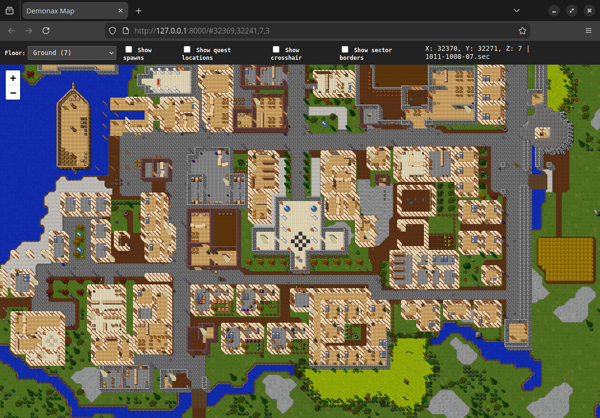
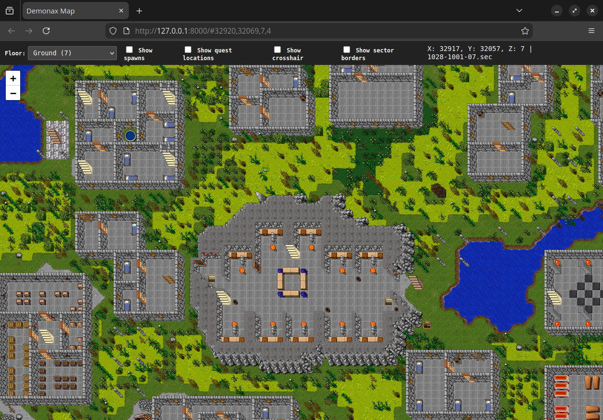
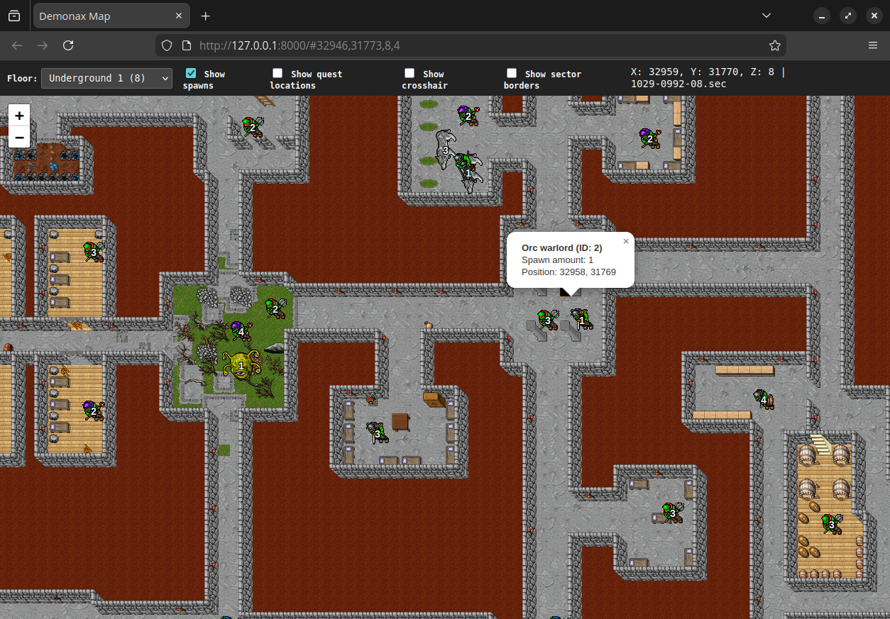
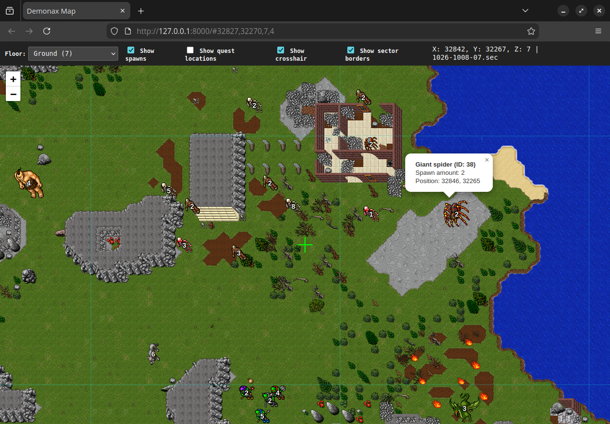
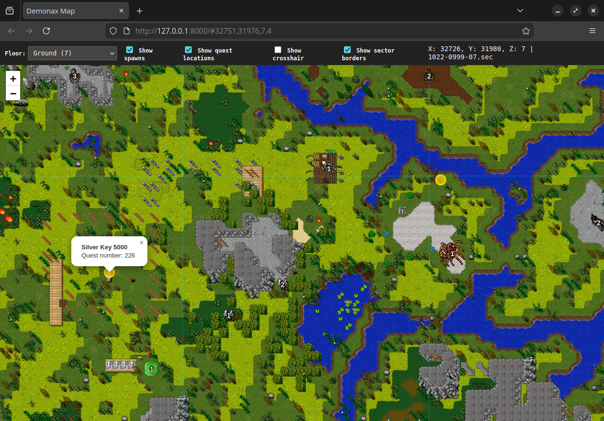
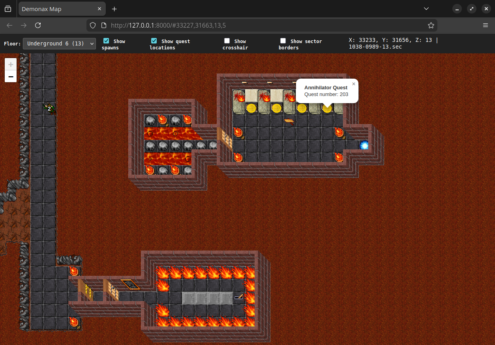

# Demonax Mapper

A map generator for Tibia-style game servers that generates zoomable [Leaflet](https://leafletjs.com/) maps from game data using sprite images.

## Features

- **Sprite-based rendering**: Uses in-game sprites for map visualization, not just a colormap
- **Multi-zoom support**: Generates tiles at multiple zoom levels (0-5)
- **Multi-floor support**: Generates maps for any floor (0-15), where 7 is ground floor
- **Monster spawn visualization**: Displays spawn points from `monster.db` with monster sprite images
- **NPC locations**: Displays NPC positions from CSV file with NPC sprite images
- **Map coordinate in address**: Shows position and toggle states in the web address for easy sharing
- **Quest locations**: Optionally shows locations of in-game quest items
- **Copy coordinates and sector names**: Middle click to copy the current sector name (e.g., `1011-1006-07.sec`), or Ctrl+Left click on the map to copy current coordinates (e.g., `32368,32215,7`)

## Screenshots

 

 

 

 

 

 

## Prerequisites

- Rust 2024 edition or later
- Game server files:
  - `objects.srv` for object definitions
  - `map/*.sec` for map sector files
- Sprite images (32x32 or 64x64 PNG files)

Optional for additional features:
- `monster.db` for monster spawn data
- Monster sprite PNG files named by race ID (e.g., `1.png`, `2.png`)
- `npc_locations.csv` for NPC location data
- NPC sprite PNG files named by NPC file name (e.g., `spooky.png`, `soullost.png`)
- `quest_overview.csv` file with quest number and quest name mappings

## Input files structure

Most required inputs are in your `game` directory:

```bash
game/                          # Game directory
├── dat/
│   ├── objects.srv            # Object definitions (--objects-path)
│   └── monster.db             # Monster spawn database (--monster-db)
├── mon/                       # Monster definitions (--mon-path)
│   ├── hunter.mon
│   └── ...
└── map/                       # Map directory (--map-path)
    ├── 0996-0984-07.sec       # Sector files
    └── ...
```

You also need the in-game sprites saved as `.png` images and named after the corresponding object ID:

```bash
sprites/                       # Sprite directory (--sprite-path)
├── 1.png                      # Object sprite files named by object ID
├── 2.png
├── 1234.png
└── ...
```

Sprite images should be extracted from your game's `.spr` and `.dat` files. You can use [OTS Item Images Generator](https://item-images.ots.me/generator/) or some other sprite extraction tool.

The same goes for monster sprites, named after race ID (e.g., 11 for hunter):

```bash
monster-sprites/               # Optional: Monster sprites (--monster-sprites)
├── 11.png                     # Monster sprite files named by race ID
└── ...
```

If you omit the `--monster-sprites` flag then no spawns are generated and the corresponding button is disabled.

For NPC locations, you'll need a `.csv` file formatted as follows:

```text
id,file_name,npc_name,x,y,z
113,spooky,"A Ghostly Woman",32191,31811,5
22,soullost,"A Lost Soul",32209,31924,12
...
```

The NPC sprite files should be named by the `file_name` column (e.g., `spooky.png`). Both `--npc-csv` and `--npc-sprites` are required for NPC visualization.

Finally, if you want to show quest locations, you'll need a `.csv` file formatted as follows:

```text
quest_value,quest_name
110,Plate Armor Quest
111,Stealth Ring Quest
...
```

The quest value is used to match against `ChestQuestNumber=` values found in `.sec` files, and the name is included in the output JSON. If omitted, all quest chest locations will show "Unknown quest".

## Installation

```bash
cargo build --release
```

The binary will be available at `target/release/demonax-mapper`.

## Usage

### Basic map generation

Generate a map for floor 7 with default zoom levels (0-5):

```bash
./target/release/demonax-mapper build \
    --objects-path /path/to/game/dat/objects.srv \
    --map-path /path/to/game/map \
    --sprite-path /path/to/sprites \
    --floors 7
```

### Multiple floors

Generate maps for all floors (0-15):

```bash
./target/release/demonax-mapper build \
    --objects-path /path/to/game/dat/objects.srv \
    --map-path /path/to/game/map \
    --sprite-path /path/to/sprites \
    --floors 0-15
```

### Custom zoom levels

Generate only specific zoom levels:

```bash
./target/release/demonax-mapper build \
    --objects-path /path/to/game/dat/objects.srv \
    --map-path /path/to/game/map \
    --sprite-path /path/to/sprites \
    --floors 7 \
    --min-zoom 3 \
    --max-zoom 5
```

### Custom output directory

```bash
./target/release/demonax-mapper build \
    --objects-path /path/to/game/dat/objects.srv \
    --map-path /path/to/game/map \
    --sprite-path /path/to/sprites \
    --floors 7 \
    --output my-map
```

### Include monster spawns

Generate map with monster spawn points:

```bash
./target/release/demonax-mapper build \
    --objects-path /path/to/game/dat/objects.srv \
    --map-path /path/to/game/map \
    --sprite-path /path/to/sprites \
    --floors 7 \
    --monster-db /path/to/monster.db \
    --monster-names-dir /path/to/mon \
    --monster-sprites /path/to/monster-sprites
```

Monster spawns will be displayed as markers on the map with creature images.

**Note:** Both `--monster-db` and `--monster-sprites` are required for monster spawn visualization.

### Include NPC locations

Generate map with NPC location markers:

```bash
./target/release/demonax-mapper build \
    --objects-path /path/to/game/dat/objects.srv \
    --map-path /path/to/game/map \
    --sprite-path /path/to/sprites \
    --floors 7 \
    --npc-csv /path/to/npc_locations.csv \
    --npc-sprites /path/to/npc-sprites
```

NPCs will be displayed as markers on the map with their sprite images.

**Note:** Both `--npc-csv` and `--npc-sprites` are required for NPC visualization.

### Controlling thread count

By default, the mapper uses all available CPU cores. You can limit this with `--threads` or `-j`:

```bash
./target/release/demonax-mapper build \
    --objects-path /path/to/game/dat/objects.srv \
    --map-path /path/to/game/map \
    --sprite-path /path/to/sprites \
    --floors 0-15 \
    --threads 4
```

### Verbose output

Add `-v` flags for more detailed logging:

```bash
# Info level
./target/release/demonax-mapper -v build ...

# Debug level
./target/release/demonax-mapper -vv build ...

# Trace level
./target/release/demonax-mapper -vvv build ...
```

## Testing locally

After generating the map, you can test it locally using Python's built-in HTTP server:

```bash
cd output && python3 -m http.server 8000
```

Then open your browser to `http://localhost:8000` to view the interactive map.

**Note:** A local web server is required because the map tiles are loaded via HTTP requests. Simply opening `index.html` in a browser won't work due to CORS restrictions.

## Sharing map links

The map URL includes both the current position and the state of all toggles (spawns, NPCs, quests, crosshair, grid), making it easy to share specific views:

```
http://localhost:8000/#32500,32300,7,4?spawns=1&npcs=1&quests=1
```

URL format: `#x,y,floor,zoom?toggles`

Toggle parameters:
- `spawns=1` - Show monster spawns
- `npcs=1` - Show NPC locations
- `quests=1` - Show quest chest locations
- `crosshair=1` - Show center crosshair
- `grid=1` - Show sector grid

When someone opens a URL with toggle parameters, the map will automatically enable those overlays. This is useful for:
- Linking to specific NPC locations in guides
- Sharing spawn area information
- Creating bookmarks for quest locations

## Output structure

After generation, the output directory contains:

```bash
output/
├── index.html          # Interactive map viewer
├── spawns.json         # Monster spawn data (optional, when using --monster-db)
├── monsters/           # Monster sprite images (optional, when using --monster-sprites)
│   ├── 1.png           # PNG files named by race ID
│   ├── 2.png
│   └── ...
├── npcs.json           # NPC location data (optional, when using --npc-csv)
├── npcs/               # NPC sprite images (optional, when using --npc-sprites)
│   ├── spooky.png      # PNG files named by file_name
│   ├── soullost.png
│   └── ...
├── questchests.json    # Quest chest locations (optional, when using --quest-csv)
├── 7/                  # Floor 7
│   ├── 0/              # Zoom level 0
│   │   ├── 0/          # Tile column 0
│   │   │   ├── 0.png
│   │   │   ├── 1.png
│   │   │   └── ...
│   │   └── ...
│   ├── 1/              # Zoom level 1
│   └── ...
└── ...
```

## Deployment

### Server requirements

No PHP or backend server required! The map is pure static HTML/CSS/JavaScript and works with any static web hosting. However:

- **Web server required**: You cannot open `index.html` directly in a browser (file:// protocol) because the map uses `fetch()` to load JSON data files, which requires HTTP/HTTPS
- **Any static server works**: Python's `http.server`, Nginx, Apache, GitHub Pages, Netlify, Vercel, Cloudflare Pages, etc.
- **CDN dependencies**: The map loads `Leaflet.js` from unpkg.com CDN, so users need internet access to view the map

## Caching

The mapper caches parsed data in `.demonax-cache/`:

- `objects.json` - Parsed object definitions
- `maps/floor_XX_sprite.json` - Parsed map data per floor

Delete the cache directory to force re-parsing:

```bash
rm -rf .demonax-cache
```

## Performance

Typical performance for a single floor at zoom levels 0-5:
- ~30-35 seconds for ~36,000 tiles
- Utilizes parallel processing for optimal speed
- Memory usage scales with sprite cache size

You can control the number of threads used with `--threads` / `-j` argument.

## Rendering details

### Sprite positioning

- Sprites use **anchor point positioning** (bottom-right corner)
- Multi-tile sprites (64x64, 64x32, 32x64) automatically extend from their anchor
- Sprites at sector boundaries correctly render across edges

### Layer ordering

Objects are rendered in the following layer order:

1. **Ground**: Objects with `is_ground=true` or `Bank` flag (floors, water, swamp)
2. **Clip**: Objects with `Clip` flag (grass overlays, small decorations)
3. **Bottom**: Objects with `Bottom` or `Text` flag (walls, doors, signs)
4. **Normal**: All other objects
5. **Top**: Objects with `Top` flag (open doors, hangings)

### Z-ordering

Tiles are sorted by `(Y ascending, X ascending)` to ensure correct isometric perspective:

- Objects farther north (lower Y) render first
- Objects farther west (lower X) render first
- Objects closer to the viewer (higher Y, higher X) render on top
